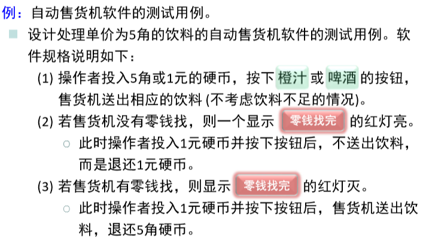
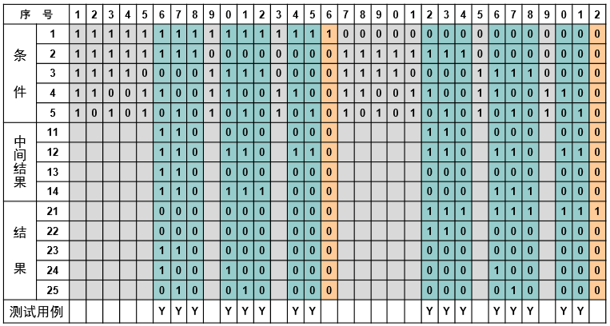

# stmt_se2017_17343105\_田皓_assign_6

分析Chap.5 (Lec.17) 自动售货机软件例子生成的判定表图例的第6列和第23 列，分别给出：

## 输入条件的自然语义陈述

第6列：C1售货机中有零钱，C2用户投入一元硬币，C4按下橙汁按钮。

第23列：~C1售货机中没有零钱找，C2投入一元硬币，C5按下啤酒按钮。

## 输出结果的自然语义陈述

第6列：E23售货机找回5角硬币，E24送出橙汁饮料。

第23列：E21售货机零钱找完红灯亮，E22退还1元硬币。

## 用命题逻辑形式描述实现上述输入-输出过程所应用的判定规则，并写出获得输出结果的推理演算过程

### 第6列：

输入

实现上述输入-输出过程所应用的判定规则：
$$
C_4 ∨ C_5 => T_{12} \\
C_2 ∧ T_{12} => T_{11}\\
C_1 ∧ T_{11} => T_{13}\\
C_3 ∨ T_{13} => T_{14}\\
T_{13} => E_{23}\\
C_4 ∧ T_{14} => E_{24}
$$

推理演算过程：以C1，C2，C4为前提，应用上述规则地：
$$
T_{12} = C_4 ∨ C_5 = 1\\
T_{11} = C_2 ∧ T_{12} = 1\\
T_{13} = C_1 ∧ T_{11} = 1\\
T_{14} = C_3 ∨ T_{13} = 1\\
E_{23} = T_{13} = 1\\
E_{24} = C_4 ∧ T_{14} = 1
$$

证明逻辑结论E23和E24

### 第23列：

实现上述输入-输出过程所应用的判定规则：

$$
C_4 ∨ C_5 => T_{12}\\
C_2 ∧ T_{12} => T_{11}\\
~C_1 => E_{21}\\
~C_1 ∧ T_{11} => E_{22}
$$

推理演算过程：以~C1，C2，C5为前提，应用上述规则得：
$$
T_{12} = C_4 ∨ C_5 = 1\\
T_{11} = C_2 ∧ T_{12} = 1\\
E_{21} = ~C_1 = 1\\
E_{22} = ~C_1 ∧ T_{11} = 1
$$
证明逻辑结论 E21 和 E22。

