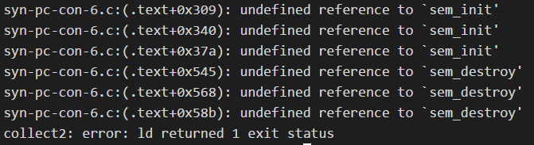
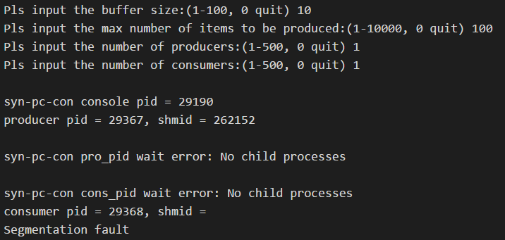
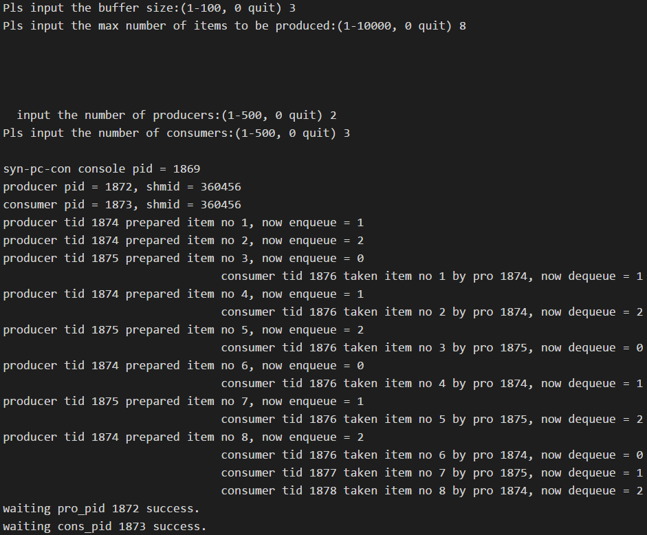
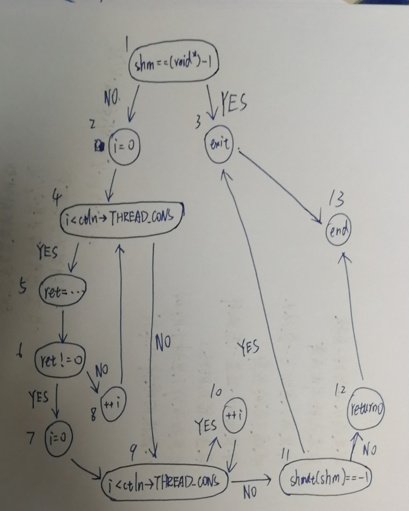

# 《软件测试》期末大作业_17343104_17343105

## 测试内容

1. 静态测试：对源代码以你的观点进行静态代码检查，给出检查报告。

2. 复杂性分析：

   a)    计算 syn-pc-con-6.c 的 *Hastead* 复杂度；

   b)    计算 syn-pc-consumer-6.c 的 *McCabe* 复杂度。

3. 白盒测试：

   a)    对 syn-pc-consumer-6.c 实现条件覆盖测试。

4. 黑盒测试：

   a)    对主控模块 syn-pc-con-6.c 的输入实现等价类划分测试。

5. 系统测试：

   a)    自行选择两种故障模型进行软件故障静态注入测试。

## 测试环境

## 测试用例

## 测试过程

### 静态测试

直接尝试编译：

~~~bash
gcc syn-pc-con-6.c -o test
~~~

报错：找不到 `syn-pc-con-5.h` ，查看代码发现`#include`的文件名错误，改为 `syn-pc-con-6.h`

再次执行，报错：

因为 `pthread` 并非默认Linux默认链接库，需要显示链接，即编译命令加上参数 `-lpthread` ，发现作业要求中【测试材料】部分有提及。

~~~bash
gcc -lpthread syn-pc-con-6.c -o test
~~~

编译成功，创建空目录`mytest`，运行 `./test mytest` 没有反应，查看代码发现文件名写死，再次修改编译命令

~~~bash
gcc -lpthread syn-pc-con-6.c -o syn-pc-con-6.o
~~~

编译成功，运行 `./syn-pc-con-6.o mytest`：

段错误，查看源代码，发现需要调用另外两个文件编译生成的程序，于是执行编译

~~~bash
gcc -lpthread syn-pc-consumer-6.c -o syn-pc-consumer-6.o
gcc -lpthread syn-pc-producer-6.c -o syn-pc-producer-6.o
~~~

再次运行 `./syn-pc-con-6.o mytest`，得到截图中结果：

### 复杂性分析

a)    计算 syn-pc-con-6.c 的 *Hastead* 复杂度；

| 操作符   | 数量     | 操作数       | 数量     |
| -------- | -------- | ------------ | -------- |
| if       | 30       | childpid     | 7        |
| <=       | 4        | pro_pid      | 8        |
| <        | 6        | cons_pid     | 8        |
| ==       | 13       | statbuf      | 2        |
| &        | 11       | buffer_size  | 10       |
| while    | 1        | max_item_num | 7        |
| return   | 14       | thread_pro   | 7        |
| continue | 4        | thread_cons  | 7        |
| break    | 1        | argc         | 2        |
| =        | 36       | argv         | 11       |
| ->       | 16       | EXIT_FAILURE | 7        |
| >        | 2        | ctln         | 20       |
| else     | 5        | data         | 8        |
| !=       | 2        | key          | 7        |
| -        | 13       | ret          | 13       |
|          |          | shmid        | 13       |
|          |          | 0            | 32       |
|          |          | 1            | 14       |
|          |          | 2            | 3        |
|          |          | 10           | 7        |
|          |          | 3            | 1        |
|          |          | 0x28         | 1        |
| n1 = 15  | N1 = 158 | n2 = 21      | N2 = 185 |

b)    计算 syn-pc-consumer-6.c 的 *McCabe* 复杂度。

程序控制流图如下：

McCabe复杂度：V(G) = d +1 = 5 + 1 = 6， d为单条件判断节点个数

### 白盒测试

a)    对 syn-pc-consumer-6.c 实现条件覆盖测试。

### 黑盒测试

a)    对主控模块 syn-pc-con-6.c 的输入实现等价类划分测试。

| buffer_size | max_item_num | thread_pro | thread_cons |
| ----------- | ------------ | ---------- | ----------- |
|             |              |            |             |
|             |              |            |             |
|             |              |            |             |

### 系统测试

a)    自行选择两种故障模型进行软件故障静态注入测试。

## 测试结果

## 技术日志

### 奇怪的 (void *)-1  

~~~c
shm = shmat(shmid, 0, 0);
if (shm == (void *)-1) {
    perror("\nsyn-pc-consumer shmat failed");
    exit(EXIT_FAILURE);
}
~~~

`(void *)-1  `表示把 -1 转换为无类型指针 `0xFFFFFFF`，以前没有见过这样的条件判断，所以了解了一下用途。

shmat函数的原型为:

~~~c
void *shmat(int shm_id, const void *shm_addr, int shcmflg);
~~~

调用成功时返回一个指向共享内存第一个字节的指针，如果调用失败返回-1，类型为`void *`，所以用`shm == (void *)-1`来判断shmat是否调用成功。

